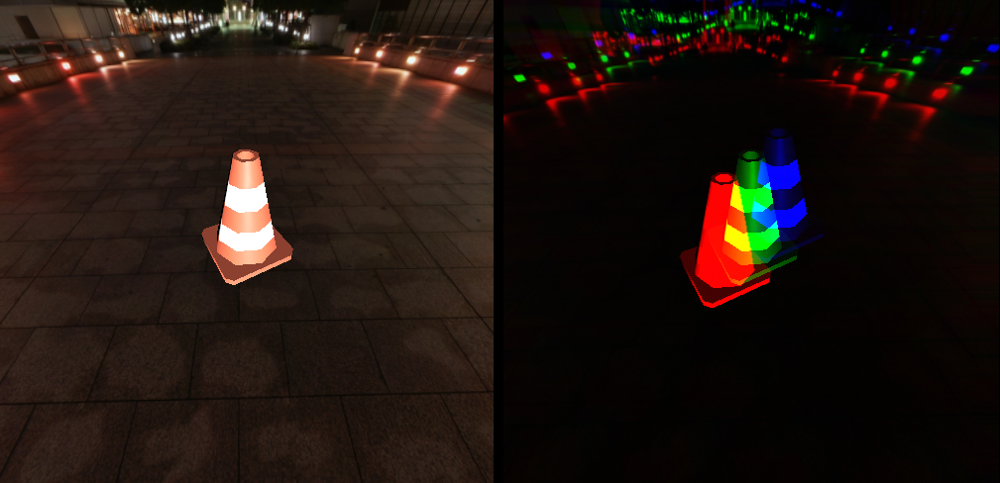

## Shader Effects

* Chromatic Aberration
* Cubemap
* Phong Shading
* Texture Mapping via [Three.JS](https://threejs.org/)

### Requirements
* Any modern browser capable of running Javascript.
* WebGL Compatible graphics drivers, you check this [here](https://get.webgl.org/).

### Credits
- **Models**
  - Banana Milkshake Model: Lab Assets by [MilkandBanana](https://milkandbanana.itch.io/lab-assets)
  - Chip Bag Model: Low Poly Potato Chip Pack by [pbj](https://pbj-time-yesh.itch.io/potato-chip-model-pack)
  - Traffic Cone Model: Traffic Assets by [MilkandBanana](https://milkandbanana.itch.io/traffic-road-assets)
- **Word Art**
  - [Word Art Generator](https://www.makewordart.com/) by [Mike McMillan](https://www.mcchill.in/?utm_source=makewordart)